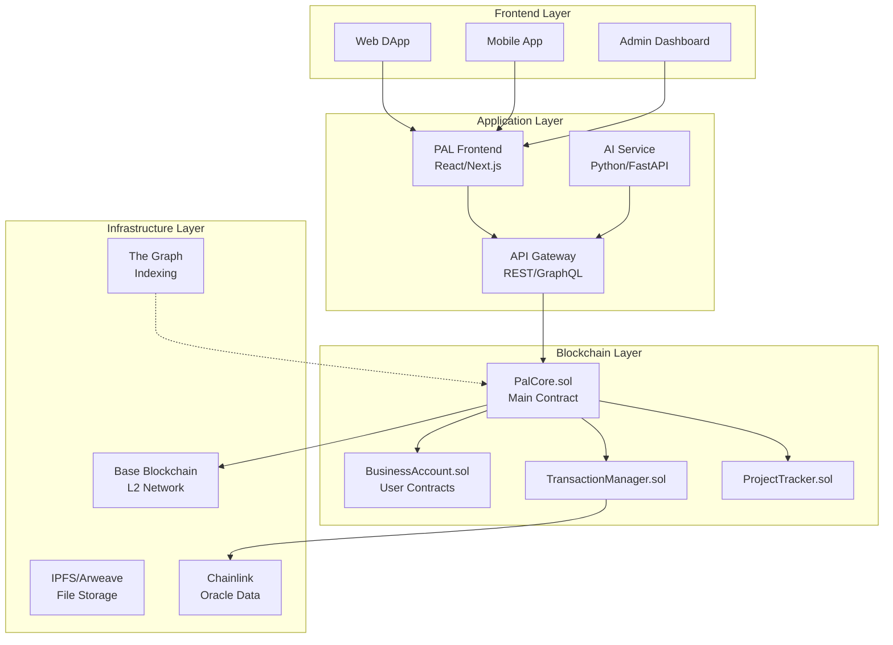
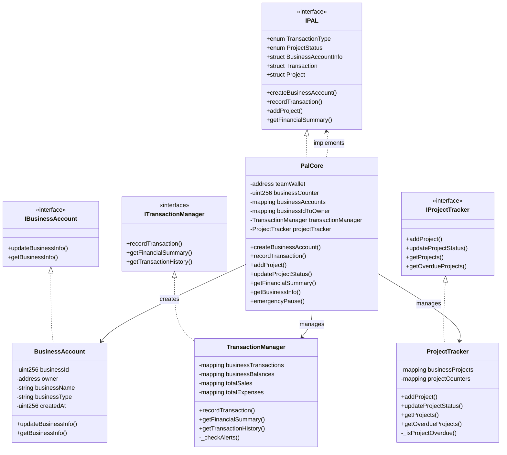
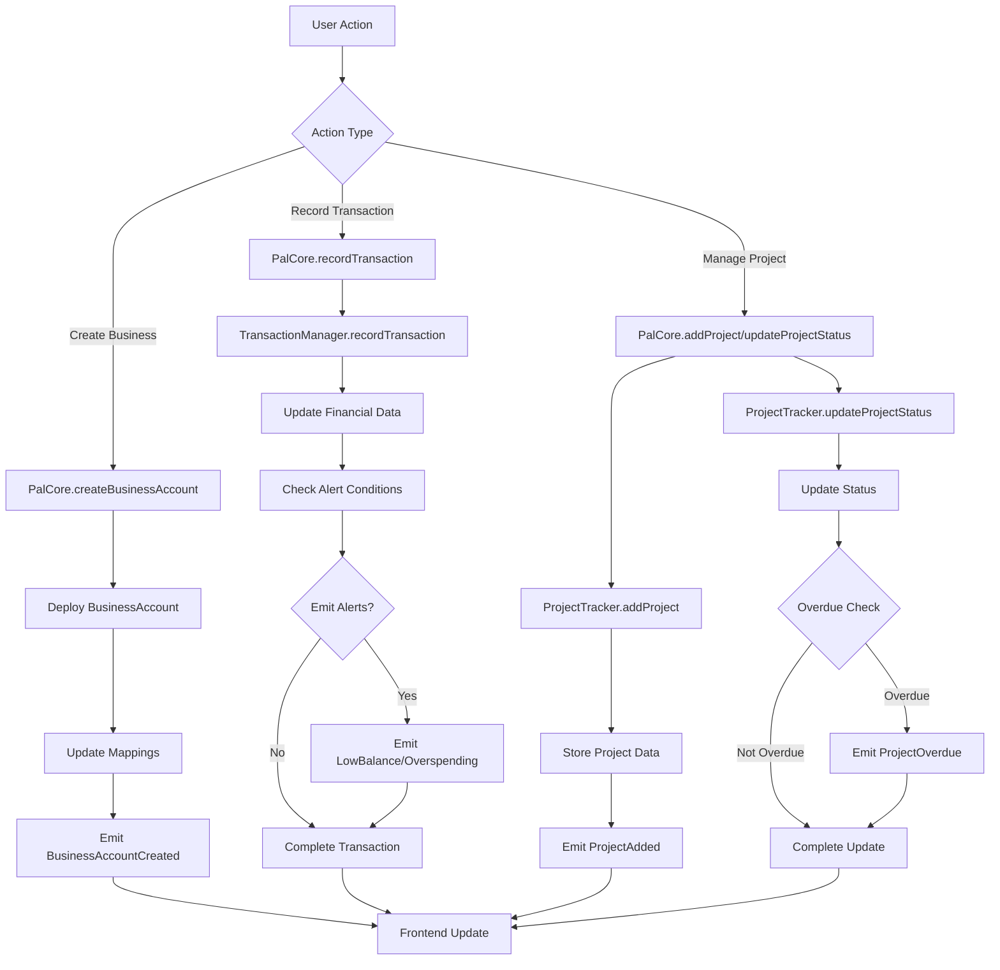
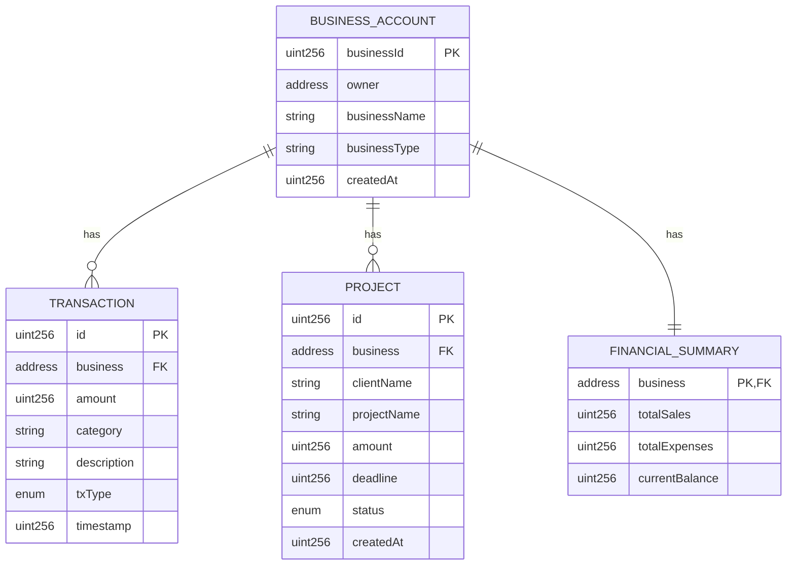
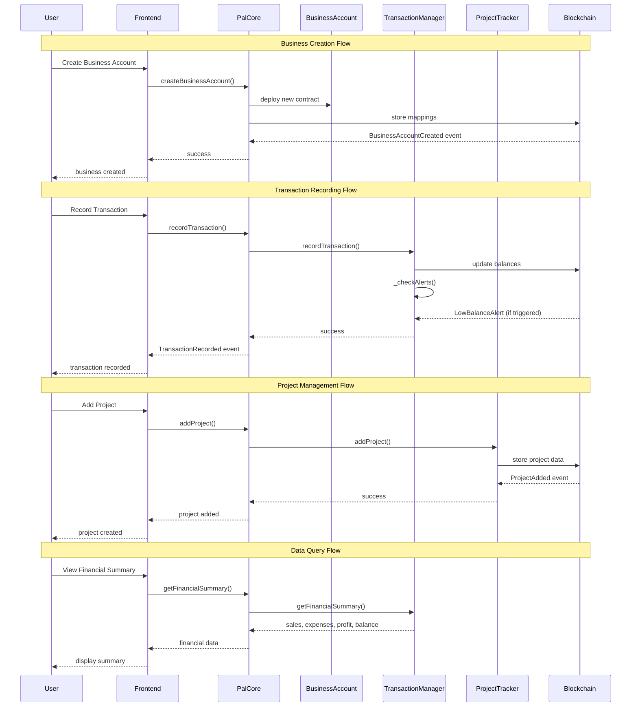

# PAL Business Management System

A comprehensive on-chain business management system built on Base blockchain that enables businesses to track finances, manage projects, and automate financial insights.

## 🎯 Overview

PAL is a decentralized business management platform that provides:
- **On-chain business account management**
- **Real-time financial tracking** (sales, expenses, profits)
- **Project and client management**
- **Automated financial alerts**
- **AI-ready data structure** for future insights

Built with **Solidity 0.8.30** and **Foundry** for maximum security and efficiency.

## 🚀 Features

### Core MVP Features
- ✅ **Business Account Setup** - Unique on-chain business identities
- ✅ **Transaction Recording** - Sales, purchases, and expense tracking
- ✅ **Profit & Balance Tracking** - Automated financial calculations
- ✅ **Project Management** - Client projects with deadlines and status
- ✅ **Smart Alerts** - Low balance and overspending notifications
- ✅ **Access Control** - Team admin functions and user permissions

### Future Features
- 🔄 **Reward System** - PAL token incentives for active users
- 🔄 **Advanced Analytics** - AI-powered business insights
- 🔄 **Invoice Management** - Blockchain-based invoicing
- 🔄 **Multi-chain Support** - Cross-chain business management

# 🏗️ System Architecture


## High-Level Overview



## Detailed Smart Contract Architecture




## Component Interaction Flow



## Storage Architecture



## Data Flow Architecture


# 🛠️ Installation
Prerequisites

- Foundry: curl -L https://foundry.paradigm.xyz | bash

- Node.js (v16+ recommended)

- Base Sepolia ETH for testing

## Setup
```bash

# Clone repository
git clone https://github.com/Nworah-Gabriel/PAL-Contracts

cd pal-contracts

# Install dependencies
forge install

# Build contracts
forge build

# Run tests
forge test
```

## Environment Setup

Create `.env` file and and add the code below to the file

```bash
# Deployment
PRIVATE_KEY=your_private_key_here
TEAM_WALLET=0xYourTeamWalletAddress

# Networks
BASE_MAINNET_RPC=https://mainnet.base.org
BASE_SEPOLIA_RPC=https://sepolia.base.org

# Configuration
DEPLOY_NETWORK=84532

# Verification
ETHERSCAN_API_KEY=your_etherscan_api_key
```

## 🧪 Testing
Comprehensive Test Suite

```bash
# Run all tests
forge test

# Run specific test suites
forge test --match-contract UnitTest
forge test --match-contract IntegrationTest
forge test --match-contract FuzzTest
forge test --match-contract AuditTest

# Run with gas reports
forge test --gas-report

# Run with verbose output
forge test -vvv
```
## Test Coverage

- Unit Tests: Individual contract functionality

- Integration Tests: Cross-contract workflows

- Fuzz Tests: Property-based testing with random inputs

- Audit Tests: Security vulnerability checks

## 🚀 Deployment
### Base Sepolia (Testnet)
```bash

forge script script/DeployPalCore.s.sol:DeployBaseSepolia \
  --rpc-url $BASE_SEPOLIA_RPC \
  --broadcast \
  --verify \
  -vvvv
```
### Base Mainnet
```bash

forge script script/DeployPalCore.s.sol:DeployBaseMainnet \
  --rpc-url $BASE_MAINNET_RPC \
  --broadcast \
  --verify \
  -vvvv
```


## Additional Recommended Files:

### .gitignore
```gitignore
# Dependencies
node_modules/
lib/

# Build artifacts
out/
cache/
broadcast/

# Environment files
.env
.env.local
.env.production

# IDE
.vscode/
.idea/

# OS
.DS_Store
Thumbs.db

# Logs
*.log
```


## 📄 License
This project is licensed under the [MIT License](https://en.wikipedia.org/wiki/MIT_License) - see the [LICENSE file](./LICENSE) for details.